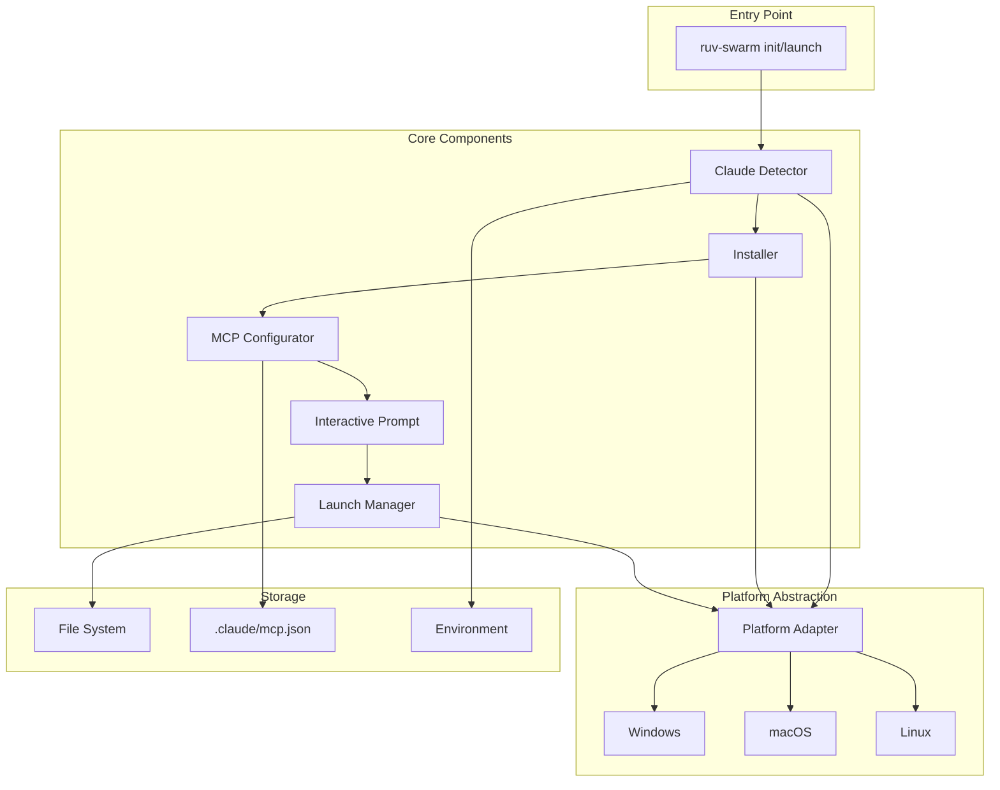
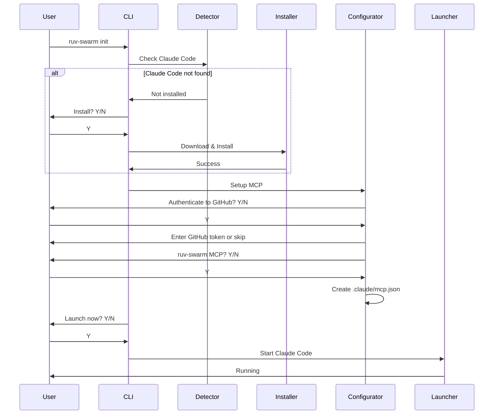
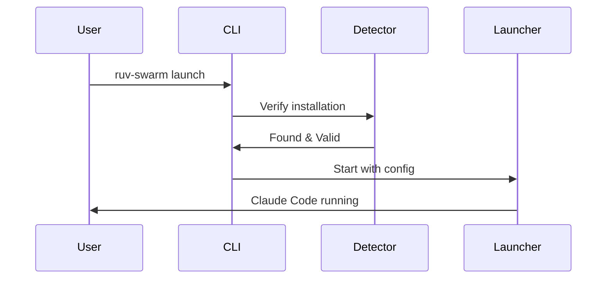

# Seamless Onboarding System Architecture

## Overview

The seamless onboarding system transforms the ruv-swarm initialization process into a guided experience that automatically sets up Claude Code with preconfigured MCP servers. This architecture prioritizes modularity, extensibility, and cross-platform compatibility while maintaining a clean separation of concerns.

## System Architecture



## Component Responsibilities

### 1. Claude Detector
- **Purpose**: Detect Claude Code installation status and version
- **Key Functions**:
  - Check multiple system paths for Claude Code binary
  - Validate installed version compatibility
  - Detect installation type (system vs user)
  - Handle platform-specific paths

### 2. Installer
- **Purpose**: Manage Claude Code installation
- **Key Functions**:
  - Download Claude Code binary
  - Handle platform-specific installation
  - Manage permissions and elevation
  - Verify installation success

### 3. MCP Configurator
- **Purpose**: Generate and manage MCP server configurations
- **Key Functions**:
  - Create `.claude/mcp.json` structure
  - Configure GitHub MCP server
  - Configure ruv-swarm MCP server
  - Validate configuration syntax
  - Handle token detection

### 4. Interactive Prompt
- **Purpose**: User interaction and decision flow
- **Key Functions**:
  - Present Y/N prompts
  - Display progress indicators
  - Handle user choices
  - Support auto-accept mode (-y flag)

### 5. Launch Manager
- **Purpose**: Start Claude Code with proper configuration
- **Key Functions**:
  - Spawn Claude Code process
  - Pass MCP configuration
  - Handle authentication flow
  - Manage session persistence

## Data Flow

### Initialization Flow



### Launch Flow (Existing Installation)



## Integration Points

### 1. Claude Code Integration
- **Binary Detection**: Search system paths, user paths, and common locations
- **Version Check**: Execute `claude-code --version` to verify compatibility
- **Launch Parameters**: Pass `--mcp-config` and `--dangerously-skip-permissions`

### 2. MCP Server Configuration
- **Config Location**: `.claude/mcp.json` in project root
- **Server Types**: ruv-swarm MCP (GitHub MCP optional, not auto-installed)
- **Environment Variables**: `GITHUB_TOKEN` (for ruv-swarm features), `SWARM_ID`, `SWARM_TOPOLOGY`

### 3. File System Operations
- **Directory Creation**: `.claude/` directory
- **Config Writing**: JSON formatting with proper escaping
- **Permission Handling**: User vs system installation paths

## Error Handling Strategy

### 1. Detection Failures
- **Binary Not Found**: Offer installation
- **Version Mismatch**: Warn and offer update
- **Permission Denied**: Fallback to user directory

### 2. Installation Failures
- **Download Failed**: Retry with exponential backoff
- **Write Failed**: Check permissions, offer alternatives
- **Verification Failed**: Rollback and report

### 3. Configuration Failures
- **Invalid JSON**: Validate before writing
- **Missing Tokens**: Offer manual entry or skip
- **File Conflicts**: Backup existing, prompt user

### 4. Launch Failures
- **Process Spawn Failed**: Check binary, permissions
- **Auth Failed**: Guide to Anthropic login
- **Config Not Found**: Regenerate or prompt

## Recovery Mechanisms

### 1. Rollback Support
```rust
pub trait Rollback {
    fn checkpoint(&mut self) -> Result<CheckpointId>;
    fn rollback(&mut self, id: CheckpointId) -> Result<()>;
    fn commit(&mut self) -> Result<()>;
}
```

### 2. Partial Success Handling
- Continue with available components
- Track what succeeded/failed
- Provide fix instructions

### 3. Retry Logic
- Network operations: 3 retries with backoff
- File operations: Permission elevation
- Process spawning: Alternative methods

## Configuration Schema

### MCP Configuration Format
```json
{
  "$schema": "https://raw.githubusercontent.com/anthropics/claude-mcp/main/schemas/mcp.schema.json",
  "mcpServers": {
    "ruv-swarm": {
      "command": "npx",
      "args": ["ruv-swarm", "mcp", "start"],
      "env": {
        "SWARM_ID": "${SWARM_ID}",
        "SWARM_TOPOLOGY": "mesh",
        "GITHUB_TOKEN": "${GITHUB_TOKEN}"
      }
    }
  }
}
```

Note: GitHub MCP server is not auto-installed. The GitHub token is used by ruv-swarm for GitHub integration features.
```

### Environment Variables
```bash
# Required for GitHub MCP
GITHUB_TOKEN=ghp_xxxxxxxxxxxx
# OR
GH_TOKEN=ghp_xxxxxxxxxxxx

# Auto-generated for ruv-swarm
SWARM_ID=<uuid>
SWARM_TOPOLOGY=mesh|hierarchical|ring|star
```

### Default Configuration Values
```toml
[onboarding]
claude_code_version = ">=1.0.0"
default_topology = "mesh"
default_max_agents = 5
auto_accept = false
retry_attempts = 3
retry_delay_ms = 1000

[paths]
claude_search_paths = [
  "/usr/local/bin",
  "/usr/bin",
  "/opt/homebrew/bin",
  "~/.local/bin",
  "~/bin"
]

[mcp_servers]
github_enabled = true
ruv_swarm_enabled = true
```

## Platform-Specific Considerations

### Windows
- **Binary Location**: `%LOCALAPPDATA%\Programs\claude-code\`
- **Path Separator**: Backslash handling
- **Permissions**: UAC elevation for system install
- **Shell**: PowerShell/CMD compatibility

### macOS
- **Binary Location**: `/Applications/Claude Code.app/Contents/MacOS/`
- **Permissions**: Code signing and Gatekeeper
- **Path**: `/usr/local/bin` symlink
- **Shell**: zsh default

### Linux
- **Binary Location**: `/usr/local/bin` or `~/.local/bin`
- **Permissions**: sudo for system install
- **Distros**: Package manager variations
- **Shell**: bash/zsh compatibility

## Security Considerations

### 1. Token Handling
- Never log tokens
- Use environment variables
- Validate token format
- Secure storage options

### 2. Permission Management
- Principle of least privilege
- Clear permission requests
- Fallback to user space
- Audit trail

### 3. Download Verification
- HTTPS only
- Checksum validation
- Official sources only
- Version pinning

## Performance Targets

| Operation | Target Time | Max Time |
|-----------|------------|----------|
| Detection | <100ms | 500ms |
| Download | <30s | 2min |
| Installation | <5s | 30s |
| Configuration | <1s | 5s |
| Launch | <2s | 10s |
| **Total** | **<40s** | **3min** |

## Extensibility Points

### 1. Additional MCP Servers
- Plugin architecture for new servers
- Configuration templates
- Discovery mechanism

### 2. Custom Installation Methods
- Package manager support
- Container deployment
- Remote installation

### 3. Enhanced Authentication
- OAuth flows
- SSO integration
- Credential managers

## Testing Strategy

### 1. Unit Tests
- Component isolation
- Mock file system
- Platform variations
- Error scenarios

### 2. Integration Tests
- Full flow testing
- Real installations
- Cross-platform CI
- Network failures

### 3. User Acceptance Tests
- Fresh install scenario
- Upgrade scenario
- Failure recovery
- Performance benchmarks

## Monitoring and Telemetry

### 1. Success Metrics
- Installation success rate
- Configuration accuracy
- Launch reliability
- Time to first launch

### 2. Failure Analysis
- Common failure points
- Platform-specific issues
- Network reliability
- Permission problems

### 3. User Feedback
- Prompt clarity
- Error message quality
- Recovery effectiveness
- Overall satisfaction

## Future Enhancements

### 1. Advanced Features
- Offline installation support
- Custom MCP server registry
- Configuration profiles
- Multi-project support

### 2. Integration Expansion
- IDE plugins
- CI/CD templates
- Docker images
- Cloud deployment

### 3. User Experience
- GUI installer option
- Configuration wizard
- Troubleshooting assistant
- Video tutorials

## Conclusion

This architecture provides a robust, extensible foundation for seamless onboarding while maintaining clear separation of concerns and platform compatibility. The modular design allows for independent testing and future enhancements without disrupting core functionality.