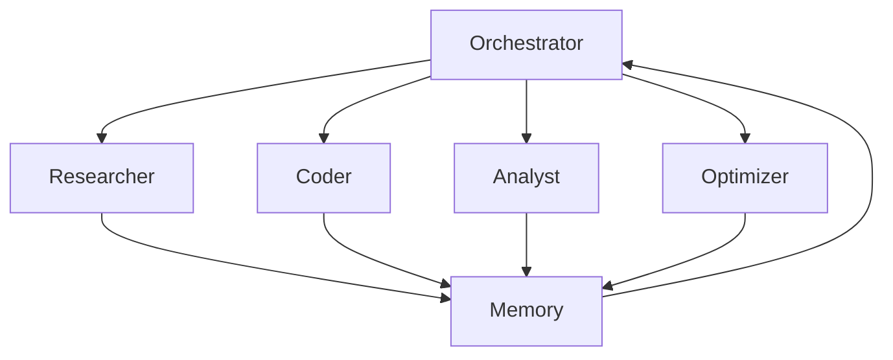
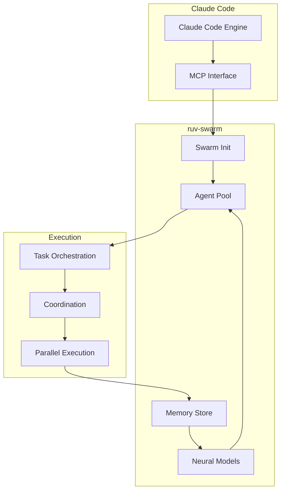

# Understanding ruv-swarm

## Intelligent Task Orchestration with Swarm Intelligence

<div class="pt-12">
  <span @click="$slidev.nav.next" class="px-2 py-1 rounded cursor-pointer" hover="bg-white bg-opacity-10">
    Press Space for next page <carbon:arrow-right class="inline"/>
  </span>
</div>

<div class="abs-br m-6 flex gap-2">
  <button @click="$slidev.nav.openInEditor()" title="Open in Editor" class="text-xl slidev-icon-btn opacity-50 !border-none !hover:text-white">
    <carbon:edit />
  </button>
  <a href="https://github.com/ruvnet/ruv-FANN" target="_blank" alt="GitHub" title="Open in GitHub"
    class="text-xl slidev-icon-btn opacity-50 !border-none !hover:text-white">
    <carbon-logo-github />
  </a>
</div>

---
transition: fade-out
---

# What is ruv-swarm?

<v-clicks>

🐝 **A swarm intelligence orchestration system** for Claude Code

🚀 **84.8% SWE-Bench solve rate** with coordinated agents

⚡ **2.8-4.4x speed improvement** through parallel execution

🧠 **27+ neural models** for cognitive diversity

💾 **Persistent memory** across sessions

🔧 **Seamless MCP integration** with Claude Code

</v-clicks>

<style>
h1 {
  background-color: #2B90B6;
  background-image: linear-gradient(45deg, #4EC5D4 10%, #146b8c 20%);
  background-size: 100%;
  -webkit-background-clip: text;
  -moz-background-clip: text;
  -webkit-text-fill-color: transparent;
  -moz-text-fill-color: transparent;
}
</style>

---
layout: two-cols
layoutClass: gap-16
---

# Key Concepts

<v-clicks>

## 🏗️ Swarm Topologies

- **Mesh**: Fully connected, collaborative
- **Hierarchical**: Structured coordination
- **Ring**: Sequential processing
- **Star**: Centralized control

## 🤖 Agent Types

- **Researcher**: Information gathering
- **Coder**: Implementation
- **Analyst**: Data processing
- **Optimizer**: Performance tuning
- **Coordinator**: Task management

</v-clicks>

::right::

<div class="mt-12">



</div>

---
class: px-20
---

# Installation & Setup

<div class="grid grid-cols-2 gap-8">

<div>

## 1️⃣ Install ruv-swarm

```bash
npm install -g ruv-swarm
```

## 2️⃣ Add to Claude Code

```bash
claude mcp add ruv-swarm npx ruv-swarm mcp start
```

## 3️⃣ Verify Installation

```bash
ruv-swarm --version
```

</div>

<div v-click>

## 📝 Configuration

The MCP server configuration is automatically added to your Claude Code settings:

```json
{
  "mcpServers": {
    "ruv-swarm": {
      "command": "npx",
      "args": ["ruv-swarm", "mcp", "start"]
    }
  }
}
```

</div>

</div>

---
layout: center
class: text-center
---

# Core Architecture

<div class="mt-8">



</div>

---

# Basic Usage Example

<div class="grid grid-cols-2 gap-4">

<div>

## Initialize a Swarm

```javascript
// Use MCP tool in Claude Code
mcp__ruv-swarm__swarm_init({
  topology: "mesh",
  maxAgents: 5,
  strategy: "balanced"
})
```

## Spawn Agents

```javascript
// Create specialized agents
mcp__ruv-swarm__agent_spawn({
  type: "researcher",
  name: "Doc Analyzer"
})

mcp__ruv-swarm__agent_spawn({
  type: "coder",
  name: "Implementer"
})
```

</div>

<div v-click>

## Orchestrate Tasks

```javascript
// Break down complex tasks
mcp__ruv-swarm__task_orchestrate({
  task: "Implement authentication system",
  strategy: "parallel",
  priority: "high"
})
```

## Monitor Progress

```javascript
// Real-time monitoring
mcp__ruv-swarm__swarm_monitor({
  duration: 30,
  interval: 2
})
```

</div>

</div>

---
layout: image-right
image: https://images.unsplash.com/photo-1558494949-ef010cbdcc31?w=800
---

# Parallel Execution

## The Power of Batch Operations

<v-clicks>

### ❌ Sequential (Slow)
```javascript
Message 1: Initialize swarm
Message 2: Spawn agent 1
Message 3: Spawn agent 2
Message 4: Create file 1
Message 5: Create file 2
```

### ✅ Parallel (Fast)
```javascript
Single Message with BatchTool:
  - mcp__ruv-swarm__swarm_init
  - mcp__ruv-swarm__agent_spawn (x5)
  - Write file1.js
  - Write file2.js
  - Bash commands
```

**Result: 2.8-4.4x speed improvement!**

</v-clicks>

---

# Memory & Persistence

<div class="grid grid-cols-2 gap-8">

<div>

## Store Context

```javascript
mcp__ruv-swarm__memory_usage({
  action: "store",
  key: "project/decisions",
  value: {
    architecture: "microservices",
    database: "PostgreSQL",
    auth: "JWT"
  }
})
```

## Retrieve Later

```javascript
mcp__ruv-swarm__memory_usage({
  action: "retrieve",
  key: "project/decisions"
})
```

</div>

<div v-click>

## Benefits

- 📌 **Cross-session persistence**
- 🔄 **Consistent decision making**
- 📊 **Historical tracking**
- 🧠 **Learning from past operations**

## Use Cases

- Architecture decisions
- Code patterns
- Performance metrics
- Error resolutions
- Best practices

</div>

</div>

---

# Neural Patterns

<div class="text-center mb-8">
  <h2>🧠 27+ Cognitive Models for Diverse Problem Solving</h2>
</div>

<div class="grid grid-cols-3 gap-4 text-sm">

<div>

### Convergent Thinking
- Problem solving
- Decision making
- Optimization

### Divergent Thinking
- Creative solutions
- Alternative approaches
- Innovation

</div>

<div>

### Lateral Thinking
- Out-of-box solutions
- Pattern breaking
- Novel connections

### Systems Thinking
- Holistic view
- Complex interactions
- Emergent behavior

</div>

<div>

### Critical Analysis
- Error detection
- Risk assessment
- Quality control

### Abstract Reasoning
- Pattern recognition
- Conceptual modeling
- Framework design

</div>

</div>

<div v-click class="mt-8 text-center">

```javascript
// Train neural patterns
mcp__ruv-swarm__neural_train({
  iterations: 10
})
```

</div>

---
layout: center
---

# Real-World Example

## Building a REST API with Authentication

<div class="mt-8">

```javascript {all|1-6|8-14|16-21|all}
// Step 1: Initialize Swarm
mcp__ruv-swarm__swarm_init({
  topology: "hierarchical",
  maxAgents: 8,
  strategy: "specialized"
})

// Step 2: Spawn Specialized Agents
[
  { type: "architect", name: "System Designer" },
  { type: "coder", name: "API Developer" },
  { type: "coder", name: "Auth Expert" },
  { type: "analyst", name: "DB Designer" },
  { type: "tester", name: "QA Engineer" }
].forEach(agent => mcp__ruv-swarm__agent_spawn(agent))

// Step 3: Orchestrate Implementation
mcp__ruv-swarm__task_orchestrate({
  task: "Build REST API with JWT auth, PostgreSQL, and tests",
  strategy: "parallel",
  priority: "high"
})
```

</div>

---

# Best Practices

<div class="grid grid-cols-2 gap-8">

<div>

## ✅ DO

<v-clicks>

- **Batch operations** for speed
- **Use memory** for persistence
- **Monitor progress** regularly
- **Train neural patterns** for improvement
- **Choose right topology** for task
- **Leverage parallel execution**

</v-clicks>

</div>

<div>

## ❌ DON'T

<v-clicks>

- Send sequential messages
- Ignore coordination hooks
- Skip memory storage
- Use wrong agent types
- Forget error handling
- Bypass monitoring

</v-clicks>

</div>

</div>

<div v-click class="mt-8 p-4 bg-blue-500 bg-opacity-10 rounded">

### 💡 Pro Tip

Always use BatchTool for multiple operations. If you need X operations, they should be in 1 message, not X messages!

</div>

---

# Advanced Features

<div class="grid grid-cols-2 gap-8">

<div>

## 🪝 Hooks System

- **Pre-task**: Context loading
- **Post-edit**: Progress tracking
- **Notification**: Decision sharing
- **Session management**: State persistence

```bash
npx ruv-swarm hook pre-task \
  --description "Feature implementation" \
  --auto-spawn-agents true
```

</div>

<div v-click>

## 📊 Performance Monitoring

- **Real-time metrics**
- **Bottleneck detection**
- **Token usage tracking**
- **Execution time analysis**

```javascript
mcp__ruv-swarm__benchmark_run({
  type: "all",
  iterations: 10
})
```

</div>

</div>

---
layout: two-cols
---

# Troubleshooting

## Common Issues

<v-clicks>

### 🔴 Agents Not Coordinating
- Check memory usage
- Verify hooks are running
- Monitor agent status

### 🟡 Slow Performance
- Use parallel execution
- Batch operations
- Check topology choice

### 🔵 Memory Issues
- Clear old entries
- Use proper key naming
- Monitor usage

</v-clicks>

::right::

## Solutions

<div v-click>

### Debug Commands

```bash
# Check swarm status
mcp__ruv-swarm__swarm_status({
  verbose: true
})

# View agent metrics
mcp__ruv-swarm__agent_metrics({
  metric: "all"
})

# Memory diagnostics
mcp__ruv-swarm__memory_usage({
  detail: "detailed"
})
```

</div>

---
layout: center
class: text-center
---

# Performance Results

<div class="grid grid-cols-3 gap-8 mt-12">

<div>
  <div class="text-6xl font-bold text-blue-500">84.8%</div>
  <div class="text-xl mt-2">SWE-Bench Solve Rate</div>
</div>

<div>
  <div class="text-6xl font-bold text-green-500">32.3%</div>
  <div class="text-xl mt-2">Token Reduction</div>
</div>

<div>
  <div class="text-6xl font-bold text-purple-500">4.4x</div>
  <div class="text-xl mt-2">Speed Improvement</div>
</div>

</div>

<div v-click class="mt-12 text-lg">
  Achieved through intelligent coordination, parallel execution, and neural diversity
</div>

---
layout: image
image: https://images.unsplash.com/photo-1451187580459-43490279c0fa?w=1920
class: text-center
---

# Resources & Links

<div class="mt-12 space-y-4">

<div>
  <h3>📚 Documentation</h3>
  <a href="https://github.com/ruvnet/ruv-FANN/tree/main/ruv-swarm" target="_blank">
    github.com/ruvnet/ruv-FANN
  </a>
</div>

<div>
  <h3>💬 Community</h3>
  <a href="https://github.com/ruvnet/ruv-FANN/discussions" target="_blank">
    GitHub Discussions
  </a>
</div>

<div>
  <h3>🐛 Issues</h3>
  <a href="https://github.com/ruvnet/ruv-FANN/issues" target="_blank">
    Report bugs or request features
  </a>
</div>

<div>
  <h3>📧 Contact</h3>
  <a href="mailto:ruv@ruv.net">
    ruv@ruv.net
  </a>
</div>

</div>

---
layout: center
class: text-center
---

# Thank You!

<div class="text-6xl mb-8">🐝</div>

## Start building with swarm intelligence today!

<br>

```bash
npm install -g ruv-swarm
claude mcp add ruv-swarm npx ruv-swarm mcp start
```

<br>

<div class="pt-12">
  <span @click="$slidev.nav.go(1)" class="px-4 py-2 rounded cursor-pointer bg-blue-500" hover="bg-blue-600">
    Back to Start <carbon:arrow-left class="inline"/>
  </span>
</div>